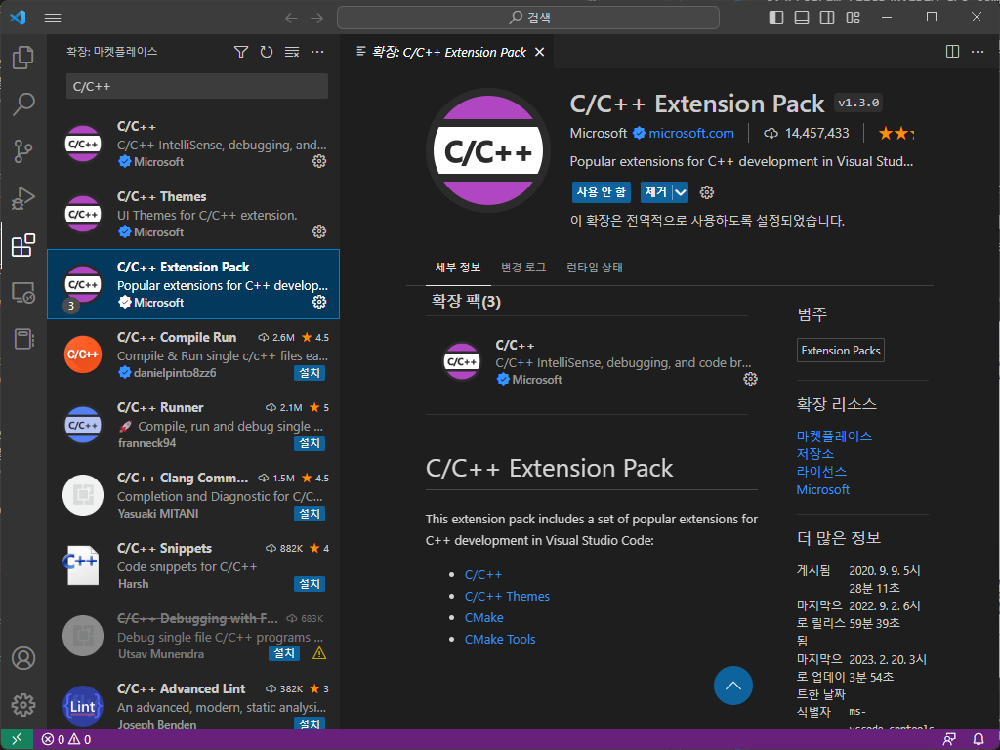

# # **개요**
본 리포지토리는 한국기술교육대학교의 컴퓨터공학부 전공 과목 [멀티코어프로그래밍](https://hpckoreatech.notion.site/Multi-core-Programming-CSE244-41dbf7d37a0b4890ae15529125d5fca7) 수업에서 제공하는 예제 코드를 Visual Studio Code에서 실행할 수 있도록 설정한 리포지토리이다.  

리포지토리의 원본은 [여기](https://gitlab.com/DuksuKim/multi-core-programming-.-cph351-koreatech)에 있다.  

> 참고:  
> #include에 사용하는 경로나 헤더 가드 등 일부 요소가 변경되었으므로 참고 바람.
> CryptoImage 과제의 경우 외부 종속성으로 OpenCV 및 기타 런타임 라이브러리가 필요하므로 Visual Studio에서 [교수님의 파일](https://koreatechackr-my.sharepoint.com/personal/bluekds_koreatech_ac_kr/_layouts/15/onedrive.aspx?id=%2Fpersonal%2Fbluekds%5Fkoreatech%5Fac%5Fkr%2FDocuments%2F%EA%B0%95%EC%9D%98%2F%EB%A9%80%ED%8B%B0%EC%BD%94%EC%96%B4%ED%94%84%EB%A1%9C%EA%B7%B8%EB%9E%98%EB%B0%8D%2F%EC%8B%A4%EC%8A%B5%2FLab1%2D2%2Ezip&parent=%2Fpersonal%2Fbluekds%5Fkoreatech%5Fac%5Fkr%2FDocuments%2F%EA%B0%95%EC%9D%98%2F%EB%A9%80%ED%8B%B0%EC%BD%94%EC%96%B4%ED%94%84%EB%A1%9C%EA%B7%B8%EB%9E%98%EB%B0%8D%2F%EC%8B%A4%EC%8A%B5&ga=1)을 통해 실행하는 것을 권장합니다.

# **# Visutal Stuio Code를 위한 개발 환경 설정**
본 문서는 **Visual Studio** 및 **Visual Studio Code**가 이미 설치되어 있다는 가정하에 LLVM을 비롯한 기타 개발 도구를 설치하는 방법을 설명한다.  
특히, 윈도우 환경에서 CUDA 환경 구축 시에는 Visual Studio에서 제공하는 컴파일러인 **cl.exe**가 필수로 요구된다.  

## **# I. LLVM**

### **1. LLVM-MINGW 다운로드**
깃허브에서 [LLVM-MINGW](https://github.com/mstorsjo/llvm-mingw/releases/tag/20220906)를 다운로드한다.  
윈도우 환경이므로 [llvm-mingw-20220906-ucrt-x86_64.zip](https://github.com/mstorsjo/llvm-mingw/releases/download/20220906/llvm-mingw-20220906-ucrt-x86_64.zip)를 받으면 된다.  
> 

### **2. 압축 해제 및 위치 선정**
다운 받은 LLVM-MINGW 파일의 압축을 해제한다.  
이때 아래 그림과 같이 폴더 안에 다시 동명의 폴더가 존재한다면, 해당 폴더를 사용한다.  
(폴더를 들어갔을 때 LICENSE.TXT 등의 파일이 바로 나타나도록 한다.)
> 

폴더를 적당한 위치로 옮긴다.  
여기서는 **C:\Program Files**에 옮긴 경우를 가정하여 설명한다.  
> 

### **3. 환경 변수 설정**
윈도우 키를 누른 후 **환경 변수**을 검색한다.  
> 

**시스템 환경 변수 편집** -> **환경 변수**로 들어간다.  
> 
> 

시스템 변수의 **새로 만들기**를 눌러 아래와 같이 입력한다.  
(변수 값은 [앞서](#2-압축-해제-및-위치-선정)에서 설정한 경로로 한다.)
> 
> |항목|값|
> |-|-|
> |변수 이름|LLVM_HOME|
> |변수 값|C:\Program Files\llvm-mingw-20220906-ucrt-x86_64|

시스템 변수에서 **PATH** 또는 **Path** 항목을 찾아 편집을 누른다.  
> 

**새로 만들기**를 눌러 아래와 같이 두 항목을 추가한다.  
> 
> ```
> %LLVM_HOME%\bin
> %LLVM_HOME%\x86_64-w64-mingw32\bin
> ```

### **4. 환경 구축 확인**
**Win + R**키를 눌러 **실행** 창을 띄워 **cmd**를 실행한다.  
> 

명령 프롬프트 창에서 아래와 같은 명령어 입력 시 다음과 같이 표시된다면 LLVM-MINGW 환경을 성공적으로 구축했다.  
> 
> ```
> clang
> lldb
> quit
> ```

## **# II. OpenMP**
OpenMP를 사용하는 데 필요한 설치는 [LLVM](#i-llvm)을 설치하고 구성하는 과정에서 이미 설치되었다.  
(환경 변수로 설정했던 **%LLVM_HOME%\x86_64-w64-mingw32\bin** 경로에 필요한 파일이 존재한다.)  
따라서 OpenMP에 대한 설치를 별도로 진행할 필요는 없다.

## **# III. CUDA**
### **1. 내 GPU에 맞는 CUDA 버전 확인**
[앞](#4-환경-구축-확인)에서 실행했던 명령 프롬프트에서 아래와 같이 입력한다.  
> 
> ```
> nvidia-smi
> ```
이때 상단에 **CUDA Version**에 표시되는 숫자가 해당 GPU에 적절한 CUDA 버전이다.  

### **2. CUDA Toolkit 설치**
[CUDA Toolkit Archive](https://developer.nvidia.com/cuda-toolkit-archive)에서 [위](#1-내-gpu에-맞는-cuda-버전-확인)에서 확인한 버전의 CUDA Toolkit을 선택한다.  

아래와 같이 현재 운영체제에 맞는 설정을 선택해 설치 파일을 다운받는다.  
> 
> 

이후 다운 받은 설치 파일을 이용하 CUDA Toolkit을 설치하면 된다.  
중간에 드라이버 버전과 관련하여 경고가 표시될 수 있으나 무시하고 설치하면 된다.  
> 참고 링크  
> [BeomBeomJoJo](https://afsdzvcx123.tistory.com/entry/%EC%9D%B8%EA%B3%B5%EC%A7%80%EB%8A%A5-Windows%EC%9C%88%EB%8F%84%EC%9A%B0-CUDA-cuDNN-%EC%84%A4%EC%B9%98%EB%B0%A9%EB%B2%95)

### **3. 설치 확인**
[앞](#4-환경-구축-확인)에서와 마찬가지로 관련 명령을 실행할 수 있는지 확인한다.
> 
> ```
> nvcc
> ```

### **4. helper_cuda.h 등 필요한 라이브러리 설정**
[NVIDIA/cuda-samle](https://github.com/NVIDIA/cuda-samples)에서 리포지토리를 [zip](https://github.com/NVIDIA/cuda-samples/archive/refs/heads/master.zip)파일로 다운로드 받는다.  
> 
> 

다운로드한 압축 파일을 풀어 cuda-samples-master -> Common의 파일을 아래의 경로로 옮긴다.  
> ```
> C:\Program Files\NVIDIA GPU Computing Toolkit\CUDA\v12.1\include
> ```

위의 경로는 컴퓨터에 CUDA Toolkit이 설치된 위치에 따라서 **달라질** 수 있다.  
특별히 설치 위치를 변경하지 않았으면 위 경로와 비슷한 경로에 설치되었을 것이므로 **Program Files** 폴더를 확인해보자.  

## **IV. Visual Studio Code 설정**

### **1. 필요한 확장 프로그램 설치**
Visual Studio의 좌측 메뉴에서 확장을 선택한다.  
> 

Microsoft에서 제공하는 [C/C++ Extension Pack](https://marketplace.visualstudio.com/items?itemName=ms-vscode.cpptools-extension-pack)을 검색하여 설치한다.  
> 

Vadim Chugunov가 제공하는 제공하는 [CodeLLDB](https://marketplace.visualstudio.com/items?itemName=vadimcn.vscode-lldb)을 검색하여 설치한다.  
> 

### **2. Visual Studio Code에서 cl.exe를 사용할 수 있도록 환경 변수 설정**
[앞](#3-환경-변수-설정)에서 LLVM에 대한 환경 변수를 설정한 것처럼 **cl.exe**에 대한 환경 변수를 설정하여 Visual Studio Code에서 실행할 수 있도록 한다.  

아까와 같이 시스템 변수의 Path에 아래와 같이 값을 추가한다.  
> 
> ```
> C:\Program Files\Microsoft Visual Studio\2022\Community\VC\Tools\MSVC\14.34.31933\bin\Hostx64\x64
> ```

위의 경로는 컴퓨터에 Visual Studio가 설치된 위치에 따라서 **달라질** 수 있다.  
특별히 설치 위치를 변경하지 않았으면 위 경로와 비슷한 경로에 설치되었을 것이므로 **Program Files** 폴더를 확인해보자.  

CMD에서 아래와 같이 표시된다면 성공적으로 환경 변수를 설정했다.  
> 
> ```
> cl
> ```

### **3. .vscode 설정**
본 리포지토리는 [.vscode](.vscode) 폴더를 포함하므로 별도의 설정이 필요없다.  
단, [c_cpp_properties.json](./.vscode/c_cpp_properties.json)은 **절대 경로**를 이용하므로 별도의 조치가 필요하다.  

> ``` json
> {
>     "configurations": [
>         {
>             "name": "Win32",
>             "includePath": [
>                 "${workspaceFolder}/**",
>                 "C:/Program Files/NVIDIA GPU Computing Toolkit/CUDA/v12.1/include"
>             ],
>             "defines": [
>                 "_DEBUG",
>                 "UNICODE",
>                 "_UNICODE"
>             ],
>             "compilerPath": "C:/Program Files/llvm-mingw-20220906-ucrt-x86_64/bin/clang.exe",
>             "cStandard": "c99",
>             "cppStandard": "c++17",
>             "intelliSenseMode": "windows-clang-x64"
>         }
>     ],
>     "version": 4
> }
> ```

위의 내용에서 **includePath**와 **compilerPath**는 절대 경로를 사용하므로 자신의 컴퓨터 환경에 맞는 경로로 설정해야 한다.  

includePath는 [여기](#4-helper_cudah-등-필요한-라이브러리-설정)에서 설정했던 경로를, compilerPath는 [여기](#3-환경-변수-설정)에서 설정했던 경로를 참고하여 확인 및 변경하면 된다.  

### **4. 빌드를 위한 단축키 설정**
앞서 설정한 **.vscode** 폴더에는 **tasks.json**과 **launch.json** 파일이 있다.  
tasks.json에는 프로그램을 실행하기 위해 실행 파일을 **만드는** 작업을 정의한다.  
launch.json에는 프로그램을 실제로 **실행하는** 작업을 정의한다.  

Visual Studio Code는 실행 파일을 만드는 작업을 위한 단축키는 기본으로 제공하지만, 이를 실행하는 단축키는 별도로 설정해야 한다.  
(F5를 이용해 실행하는 것은 **가장 최근**에 사용했던 실행 방법을 사용한다. 즉, 여러 옵션 중 선택하여 실행할 수 없다.)

**Ctrl + K, Ctrl + S**를 눌러 단축키 설정에 들어간다.  
> 

**selectandstart**를 검색해 단축키를 할당한다.  
> 

여기에서는 Alt + \\로 설정했지만 편한 키 조합을 설정하면 된다.  

### **4. 환경 구축 확인**
[HelloOpenMP](./HelloOpenMP)폴더의 [HelloOpenMP.cpp](./HelloOpenMP/HelloOpenMP.cpp) 파일을 열어보자.  

여기서 앞서 설정했던 단축키 Alt + \\를 누르면 아래와 같은 메뉴가 나타난다.  
> 

**LLDB: Clang++ 활성 파일 빌드**를 선택해 실행해보자.  
작업이 끝난 후 터미널 탭을 선택하면 아래와 같이 정상적으로 동작함을 확인할 수 있다.  
> 

**LLDB: Clang++ 활성 파일 빌드**는 현재 편집기에 열려 있는 파일 하나를 컴파일한다.  
이는 단일 파일을 실행해보고 싶을 때나 [OpenMP_Lecture1](./OpenMP_Lecture1)과 같이 main함수를 포함하는 다수의 파일이 한 폴더 내에 존재할 때 유용하다.  

**LLDB: Clang++ 활성 디렉토리 빌드**는 현재 편집기에 열려 있는 파일이 존재하는 폴더 내의 모든 소스 코드를 컴파일한다.  
이는 [__Multiple_File_Example](./__Multiple_File_Example)과 같이 한 폴더 내에 main이 존재하는 파일 하나와 다중 파일을 컴파일할 때 유용하다.  

다음으로 [CUDA_Lecture1](./CUDA_Lecture1)의 [HelloCUDA.cu](./CUDA_Lecture1/HelloCUDA.cu) 파일을 열어보자.  

단축키 Alt + \\를 눌러 **CL/LLDB: CUDA 활성 파일 빌드**를 선택한다.  
작업이 끝난 후 터미널 탭을 선택하면 아래와 같이 정상적으로 동작함을 확인할 수 있다.  
> 

[CUDA_MatrixAdd](./CUDA_MatrixAdd)의 [main.cpp](./CUDA_MatrixAdd/main.cpp)와 같이 다중 파일로 구성된 폴더는 **CL/LLDB: CUDA 활성 디렉토리 필드**를 사용하면 된다.  

작업이 끝난 후 터미널 탭을 선택하면 아래와 같이 정상적으로 동작함을 확인할 수 있다.  
> 